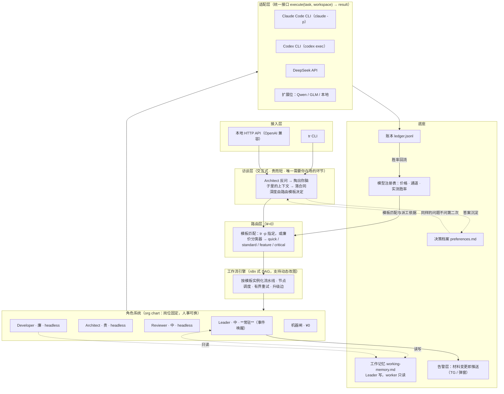
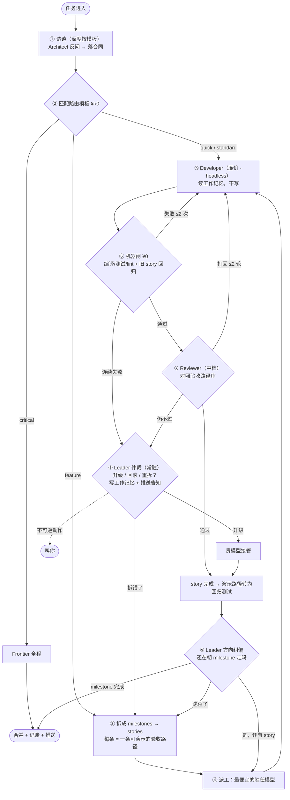

# TokenRouter 架构设计

> 一个任务拆解器：把说不清楚的需求变成一组说得清楚的合同，
> 然后用尽可能便宜的模型把它们执行掉，全程不需要你在场。

## 一、设计原则

1. **拆解就是省钱机制本身**，不是省钱的准备工作。
   合同写得越清楚，能干这活的模型就越便宜——**拆解质量 ↔ 可用模型价格**是一条直接的兑换关系。
   这就是最聪明的模型应该被放在拆解上、而且只放在拆解上的原因。
2. **合同先行**（承自 park-operating-system：发单与开工之间必须隔一张合同）。
   执行中不得回改验收标准——这是廉价模型可用的前提：它不需要聪明，只需要对得上合同。
3. **验收单元是"可演示的最小变化"**，不是实现单位。详见第四节。
4. **角色是岗位，模型是人事**。换模型 = 换人，不改组织结构。编排模型可插拔（当前 Fable 5）。
5. **只有 Leader 常驻，且常驻的是岗位与记忆，不是上下文窗口**。
   Leader 由事件唤醒：醒来 → 读工作记忆 → 判断 → 写回 → 睡。其余全部 headless。
   累积的上下文放在文件里，不放在任何模型的窗口里。
6. **事后可撤销 + 强制告知，取代事前审批**。
   审批闸会把 Leader 变成"随时要叫醒你"，等于没有 Leader。详见第六节。
7. **机器闸先于模型审**。编译、测试、lint 是免费的，永远先跑；
   绝不为编译器能发现的问题支付模型价格。
8. **按类型路由，不按任务路由**。路由是有限的模板集合，任务进来只做一次 ¥≈0 的匹配。
   为单个任务动用聪明模型做路由决策，本身就是要消灭的开销。
9. **级联优于预判**。模板内不预测难度：先用便宜模型跑，验证失败再升级。
10. **两个飞轮**：账本 → 模型胜率（路由越用越准）；决策档案 → 你的偏好（访谈越用越短）。
    前者省钱，后者省你的时间。

## 二、产品架构（图一）



| 层 | 职责 | 关键点 |
|---|---|---|
| 接入层 | CLI + 本地 API 双入口 | API 做 OpenAI 兼容，别的工具零改造接入 |
| **访谈层** | 把你脑子里的上下文掏到文件上 | 唯一需要你在场的环节；贵而短 |
| 路由层 | 任务 → 模板的一次性匹配 | ¥≈0，绝不用聪明模型做路由 |
| 工作流引擎 | 按模板实例化流水线，管重试与升级 | Leader 可在失败后改图重排 |
| 角色系统 | 岗位契约（输入/输出/验收） | 只有 Leader 常驻，其余 headless |
| 适配层 | 抹平 CLI 与 API 差异 | Claude/Codex 走无头 CLI，DeepSeek 走 HTTP |
| 底座 | 工作记忆 + 注册表 + 账本 + 决策档案 + 告警 | 告警层是"无人值守"的前提，不是可选项 |

## 三、角色定义

| 岗位 | 常驻 | 职责 | 能力要求 | 当前人事 |
|---|---|---|---|---|
| **Architect** | 否 | 访谈、拆解、写验收标准；出大问题时重拆 | 最高 | fable-5（贵） |
| **Leader** | **是** | 仲裁闸门 · 方向纠偏 · 回归守门 · 升级判断 · 写工作记忆 | 中（判断力，非创造力） | claude-sonnet |
| **Developer** | 否 | 实现合同明确的 story | 够用即可 | deepseek（廉） |
| **Reviewer** | 否 | 对照验收标准审产出 | 中 | claude-sonnet |
| **机器闸** | — | 编译 / 测试 / lint / 泄漏扫描 | 非模型，¥0，不可跳过 | 本地工具链 |

**Architect 与 Leader 是两个岗位**：一个负责"想清楚"（只在开头和重拆时出场），一个负责"守住"（全程在岗）。

Leader 存在的全部理由，是它替你吸收这五类中断：

1. **闸门仲裁** —— worker 卡住时它判断，而不是叫你
2. **方向纠偏** —— 每完成几条 story 抬头看一次：还在朝 milestone 走吗
3. **回归守门** —— 新 story 砸了旧 story 的验收路径，决定回滚还是修
4. **升级判断** —— 廉价模型两次失败，是该升级，还是这条 story 本身拆错了
5. **写工作记忆** —— 踩过的坑、定下的约定写进文件

> **工作记忆的写权限只归 Leader。** worker 只读。否则 N 个 worker 同写一个文件就是噪音。

## 四、拆解单位：可演示的最小变化

只分两级，因为只有这两级对应真实的物理边界（中间再插一层 epic 不对应任何边界，是纯文书）：

- **Milestone = 合并边界。** 一个 milestone = 一个可独立验证、可单独合并的成果 = 一个 PR。
- **Story = 模型调用边界。** 一条 story = 一个模型一次能做完的执行单元。

**每条 story 必须能写成一条演示路径：「你打开 X，做 Y，看到 Z」。**

粒度判据：

| 情况 | 处理 |
|---|---|
| 写不出演示路径（如"加个 helper 函数"） | 太细 → **往上合并** |
| 路径超过 5 步，或中间要分叉 | 太粗 → **往下拆** |

这条规则同时解决三件事：

1. **"10 小时后我在期待什么"** —— 答案是一张清单：N 条"你点这里，会看到这个"。访谈结束时就交给你，你能当场否决。
2. **回归恐惧** —— **每条已验收 story 的演示路径，直接变成一条回归测试。** 于是新 story 砸不坏旧 story。验收过的越多，后面越安全。
3. **路由免费** —— 演示路径的步数和分叉数就是复杂度指标。2–3 步 = `quick`，需要多条路径 = `feature`。连分类器都省了。

并行/串行规则直接从边界推出：**milestone 之间串行**（每个都要合并，从最新 main 开下一环）；**milestone 内的 story 可并行**，判据是文件是否重叠、有无逻辑依赖；并行 WIP ≤ 3。

## 五、访谈层

拆解不是一个函数，是一场访谈——因为最常见的障碍是**上下文和意图在你脑子里**。

五条规则（参考 mattpocock/skills 的 grilling，与 park-operating-system 的"凡 GitHub 已有的数据不得问 Park"同源）：

1. **一次只问一个问题**，等答完再问下一个
2. **能自己查的绝不问**——先读仓库，把提问变成确认（不问"用什么测试框架"，问"我看到用 pytest 且门槛 80%，这次也按这个？"）
3. **只问需要人判断的决策**
4. **每个问题必须附推荐答案**——把开放题变成判断题。**禁止提出没有默认答案的问题。**
5. **对齐之前不动手**

**停止条件（与 grilling 的"问到每个分支都解决"不同）：**

> 问到"再问下去也不会改变这条 story 能用哪个模型执行"为止。

如果一个歧义解决与否，廉价模型都能干，那就别问——**试错比提问便宜**，机器闸和升级机制会兜住。访谈的价值 = 它降低了多少执行成本，超过这个值就是在浪费你的时间。

问什么，以及谁的活：

| | 谁负责 | 典型问题 |
|---|---|---|
| **Goal** | 必须问你 | 这件事做成了，你希望看到什么变化？ |
| **验收路径** | 问你，但它给草案 | "我拟了 6 条演示路径（列出），要加要删吗？" |
| **边界** | 它自己查，你只确认 | "涉及这 6 个文件，auth.py 是核心路径。可以动吗？" |
| **红线** | 必须问你 | 有没有不能碰的东西？涉不涉及真钱或线上？ |

访谈深度由路由模板决定：

| 模板 | 访谈 |
|---|---|
| `quick` | 不问，直接跑 |
| `standard` | 最多 2 问（只问边界类） |
| `feature` | 完整拆解访谈 |
| `critical` | 全量 grilling + 确认闸 |

答案沉淀进**决策档案** `preferences.md`（"本项目不动 schema"、"覆盖率按 80%"），同一个问题永远不问第二次——访谈越用越短。

## 六、Leader 的授权边界

**设定：Leader 全权。** 不设事前审批闸——因为审批闸会把 Leader 变成"随时要叫醒你"，那等于没有 Leader，也就回到了"你走不开"的老问题。

取而代之的机制是：

> **事后可撤销 + 强制告知。**（承自 park-operating-system 的 revert 文化：不追责快，只追责瞒）

- Leader 直接做决定并执行，**不等你**
- 任何材料性变更**立即推送**（TG / 弹窗），你随时能看到发生了什么
- 每个决定都留在账本和工作记忆里，**随时可 revert**

> **告警层是"全权"的前提条件，不是可选项。** 全权而不告知 = 你是瞎的。
> 06-18 那版脑/手分离之所以没跑起来，缺的正是这一层——规则写着"告警上线前不得无人值守"，而告警从未上线。

**唯一的例外：不可逆动作。** 这不是审批问题，是物理问题——代码改动可以 revert，钱转出去不能。承自你 OS 的红线：

- diff 涉**真钱 / live** → 需 `park-approved` 标签
- **本仓（法律层）** → 永远你亲合

> 这两条是我按你现有 OS 保留的默认值。若要连这两条也去掉，删掉 config 里 `irreversible_requires_human` 一行即可。
> 实践中它大概每周只触发一次，但兜住的是唯一不可逆的部分。

**Leader 授权范围 = 你能走开的时长。** 当前设定下：一整天，除非碰到真钱。

## 七、任务流转（图二）



成本结构目标：**贵模型 ≈ 15–20%**（访谈、拆解、升级接管），**Leader ≈ 5–10%**，**廉价 ≈ 70–80%**。

升级规则（有界，防止无限烧钱）：机器闸失败自修 ≤ 2 次；Review 打回 ≤ 2 轮；超限交 Leader 仲裁；升级后仍败 → 回到拆解（说明是合同问题，不是执行问题）。

## 八、配置草案

```yaml
# tokenrouter.yaml
orchestrator:
  model: fable-5                      # 谁是最聪明的模型，你说了算

roles:
  architect: { model: fable-5,       channel: cli, resident: false }
  leader:    { model: claude-sonnet, channel: cli, resident: true }   # 唯一常驻
  reviewer:  { model: claude-sonnet, channel: cli, resident: false }
  developer: { model: deepseek,      channel: api, resident: false }

profiles:
  quick:    { pipeline: [developer, machine_gate],                     interview: none }
  standard: { pipeline: [developer, machine_gate, reviewer],           interview: minimal, default: true }
  feature:  { pipeline: [architect.decompose, developer, machine_gate, reviewer, leader.arc], interview: full }
  critical: { pipeline: [architect.solo],                              interview: full, confirm_gate: true }

router:
  match: [user_flag, demo_path_length, classifier]
  classifier_model: deepseek          # 路由绝不用聪明模型
  fallback: standard

authority:
  leader: full                        # 全权：不设事前审批
  irreversible_requires_human: true   # 唯一例外：真钱/live + 本仓；删此行即完全放开
  notify: [telegram]                  # 全权的前提——不告知就是瞎的
  revert_window: always

escalation:
  machine_gate_retries: 2
  review_rounds: 2

state:
  working_memory: ./working-memory.md # Leader 写，worker 只读
  preferences:    ./preferences.md    # 访谈答案沉淀，问过的不再问
  ledger:         ./ledger.jsonl      # 每节点：模型/tokens/成本/结果/重试
```

## 九、实施切法

1. **v0 — 级联内核 + 告警**：adapter 三件套 + 机器闸 + "廉价先跑、失败升级" + 账本 + **TG 推送**。
   模板只有 quick / standard。先在日常真实任务上跑起来攒 outcome 数据。
   *告警放在 v0 而不是往后排——它是"能走开"的前提，不是锦上添花。*
2. **v1 — 访谈与拆解**：Architect 访谈上线（五条规则 + 成本停止条件），
   按"可演示的最小变化"拆 story，演示路径自动转回归测试；决策档案开始沉淀。
3. **v2 — Leader 上岗**：常驻循环 + 工作记忆 + 五类中断吸收 + 方向纠偏。
   **这一版之前，你还是走不开。**
4. **v3 — 产品化**：注册表胜率参与派工；模板编辑可视化（向 n8n 形态靠）。

---

## 附：与 splitting the hand and the brain 的关系

06-18 那版脑/手分离没跑起来，缺的正是这里要建的东西：

| 缺的前提 | 本文档对应 |
|---|---|
| 手能自己判断安全边界 | 机器闸 + Leader 全权 + 告警层（第六节） |
| 分发是自动的，不经过你的手 | 工作流引擎 + 路由层（第二节） |
| 状态有单一真相 | 工作记忆 + 账本 + GitHub（第二节底座） |
| 有人在白天守着，且那个人不是你 | **Leader 岗位**（第三节） |

**TokenRouter 不是下一个新项目，是上一个项目失败的那个补丁。**
注意：这四项里没有一项需要第二台电脑。
