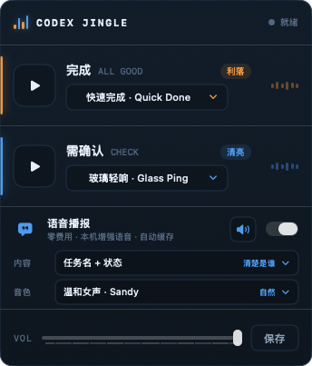

<div align="center">

# Codex Harness

**记录每个 Codex thread 的 token 使用与项目归属，输出一份本地、只读、可审计的总账。**

[](https://www.python.org/)
[](https://www.apple.com/macos/)
[](./LICENSE)
[](#数据与隐私)

</div>

---

```text
in   ~/.codex/sessions/*.jsonl + ~/.codex/archived_sessions/*.jsonl
     + optional project mapping (projects.json)
out  one row per Codex thread + daily token totals + local HTML ledger

fail unreadable/invalid JSONL       → skip the bad record; never invent usage
fail missing cumulative snapshot     → keep the thread as unavailable
fail unknown cwd                     → attribute to Uncategorized
fail unknown notify config shape     → refuse to overwrite it and keep a backup
```

Codex Harness 是一个 capability，不是成本优化器。它读取本机 Codex 历史，按
`session_meta.payload.id` 建立 thread 级账本，按 `Asia/Shanghai`（可配置）分配
每日增量，并提供一个绑定到 `127.0.0.1` 的只读 HTML 视图。

## 三秒理解

- **主能力：** 每个 Codex thread 用了多少 token、哪一天用了多少、属于哪个项目。
- **可见输出：** JSON ledger、CLI summary、七日活动、项目汇总、最近 thread ID。
- **可选提醒：** 原 Jingle 的“真狗”完成提醒已作为 Codex Harness opt-in 模块保留。
- **明确不做：** 不路由模型、不预测未来成本、不参考历史成功率做决策、不上传
  prompt/response、不调用网络 summarizer、不自动选择模型。

## 示例输出

下面是一次本机真实 `scan` 后的字段摘录；数值会随本机 Codex 历史变化，内容正文不会
进入输出：

```console
$ python3 ~/.codex/harness/codex_harness.py summary
{
  "threads": 982,
  "available_threads": 878,
  "reporting_timezone": "Asia/Shanghai",
  "tokens": {
    "fresh_input_tokens": 1361296195,
    "cached_input_tokens": 33940423040,
    "output_tokens": 97604185,
    "reasoning_output_tokens": 29133860,
    "total_tokens": 35401342794
  }
}
```

UI 提供同一份 ledger 的可视化投影：七日 token 轨迹、按产品汇总、最近 thread、
`available` / `unavailable` 状态。它不渲染 prompt 或 response 文本。



> 上图是保留的 Jingle 提醒模块参考图，不是 Codex Harness ledger 的实时数据截图。
> 当前 ledger UI 通过下面的 `ui` 命令在本机生成，避免把私人使用数据提交到公开仓库。

## 架构

```text
┌─────────────────────────────────────┐
│ Codex session JSONL                  │
│ sessions/ + archived_sessions/       │
└──────────────────┬──────────────────┘
                   │ session_meta + token_count only
                   ▼
┌─────────────────────────────────────┐
│ token_counter.extract_threads       │
│ dedupe + cumulative delta + timezone│
└──────────────────┬──────────────────┘
                   │ freeze attribution, atomic write
                   ▼
┌─────────────────────────────────────┐
│ ~/.codex/harness/threads.json       │
│ one row per thread, private ledger   │
└───────────────┬─────────────┬───────┘
                │             │
                ▼             ▼
     ┌────────────────┐  ┌────────────────────┐
     │ CLI scan/summary│  │ local HTML UI       │
     │ codex_harness.py│  │ 127.0.0.1:8765      │
     └────────────────┘  └────────────────────┘

optional:
Codex turn-ended → Harness notifier → local sound / attention speech
```

## 快速开始

```bash
# 1. 克隆唯一 active repository
git clone https://github.com/zinan92/codex-harness.git
cd codex-harness

# 2. 安装到 ~/.codex/harness/
#    只复制本地 scanner、UI 和项目映射，不创建 LaunchAgent 或网络任务。
./scripts/install.sh

# 3. 扫描 Codex 历史并打印 JSON summary
python3 ~/.codex/harness/codex_harness.py scan
python3 ~/.codex/harness/codex_harness.py summary

# 4. 启动本地只读视图，然后打开 http://127.0.0.1:8765/
python3 ~/.codex/harness/codex_harness.py ui
```

核心 ledger 可用 macOS 自带 Python 3.9+ 运行；可选完成提醒的配置编辑器需要
Python 3.11+，脚本会检查 `tomllib`，不会自动安装第三方包。

## CLI 参考

| 命令 | 作用 |
|------|------|
| `codex_harness.py scan` | 扫描默认 Codex session roots，原子写入 ledger |
| `codex_harness.py summary` | 读取 ledger，打印 thread、daily、token 汇总 |
| `codex_harness.py ui` | 启动本地 HTML 视图 |
| `... scan --remap-uncategorized` | 只对历史 `Uncategorized` 记录显式重算项目归属 |
| `... scan --sessions-root PATH` | 覆盖扫描根目录；可重复传入 |
| `... --state PATH` | 使用指定 ledger 文件进行读写 |
| `... --projects PATH` | 使用指定项目映射 JSON |
| `... ui --html` | 打印静态 HTML 后退出，不启动服务器 |
| `... ui --host 127.0.0.1 --port 8765` | 指定本地监听地址和端口 |

默认私有文件：

```text
~/.codex/harness/threads.json
~/.codex/harness/projects.json
```

## 可选：完成提醒（“真狗” / Jingle）

完成提醒默认关闭，需要时显式启用：

```bash
cd /Users/wendy/codex-harness
./scripts/enable-alert.sh

# 完全退出并重新打开 Codex 后，再试听成功提醒
python3 ~/.codex/harness/notifications/codex_harness_notify.py \
  --test-title "Codex Harness 测试" --status success

# 试听失败/阻塞/待确认提醒
python3 ~/.codex/harness/notifications/codex_harness_notify.py \
  --test-title "需要确认" --status attention
```

触发规则：

- 主 Codex turn 到达 `turn-ended`：成功状态播放完成音，不播报正文。
- 最终消息包含失败、blocked、missing evidence、pending confirmation 等确定性
  标记：播放 attention 音；语音开启时播报任务名和状态。
- subagent / internal thread completion：静默，不抢主任务注意力。
- 回调通过 `--previous-notify` 串在现有 Computer Use 通知后面，不覆盖未知回调。
- 状态、去重记录、事件日志位于 `~/.codex/harness/notifications/`；旧的
  `~/.codex/spoken-notify/` 只做 copy-only 迁移，不删除原文件。

关闭时只移除 Harness callback，并保留其它通知：

```bash
./scripts/disable-alert.sh
```

如果当前 `notify` 不是已知的单行 TOML array，脚本会停止并保留时间戳备份，
不会猜测或覆盖其它用户配置。启用或关闭后都要重启 Codex 使 `config.toml` 生效。

## 功能状态

| Capability | 状态 | 说明 |
|------------|------|------|
| Thread-level token ledger | ✅ active | 每个 `session_meta.payload.id` 一行 |
| Daily allocation | ✅ active | 默认 `Asia/Shanghai`，按 token 增量分桶 |
| Project attribution | ✅ active | 最长 CWD prefix，未知项目明确显示 `Uncategorized` |
| Read-only local UI | ✅ active | HTML projection，默认 `127.0.0.1:8765` |
| Completion alert | 🟡 opt-in | 本地声音/attention 语音，不是 LaunchAgent |
| Model router | ⛔ disabled | Codex Harness 不参与模型决策 |
| Telegram / network summarizer | ⛔ disabled | v1 不联网、不后台刷新 |
| TokenPulse widget / ranking / furnace | 📦 legacy | 仅保留历史源码，不安装、不启动 |

## 数据与隐私

Scanner 只读取：

- `session_meta`：thread ID、CWD、时间戳；
- `event_msg.payload.type == "token_count"`：累计/增量 token usage；
- `~/.codex/harness/projects.json`：本地项目映射。

Scanner 会在解析前跳过不含 `session_meta` 或 `token_count` 的行，因此不会加载
prompt/response 正文，也不会把正文写入 ledger。写入采用 owner-only 权限、临时文件、
`fsync` 和原子替换。缺失数据会保持 `unavailable`，不会用 0 冒充已知用量。

## 失败合同

| 条件 | 行为 | 你该怎么做 |
|------|------|------------|
| session JSONL 无法读取或单行 JSON 损坏 | 跳过该记录，继续扫描 | 检查本地 Codex session 文件权限 |
| thread 没有可用累计 snapshot | 保留 thread，但 `status=unavailable` | 不把该行当成 0 token |
| CWD 不在映射表 | 归入 `Uncategorized` | 更新 `projects.json` 后显式 `--remap-uncategorized` |
| 历史累计值回退 | 开启新的累计 epoch，并计入 reset count | 在 ledger 中审计 reset |
| alert 的 notify shape 未知 | 拒绝修改并写备份 | 手动检查配置，不要强行覆盖 |

## 项目结构

```text
codex-harness/
├── src/
│   ├── codex_harness.py        # canonical CLI
│   ├── token_counter.py        # ledger parser and accounting contract
│   ├── token_counter_ui.py     # local HTML projection
│   ├── codex_spoken_notify.py  # optional completion alert runtime
│   └── harness_alert_config.py # safe notify-chain editor
├── scripts/
│   ├── install.sh              # passive local install
│   ├── enable-alert.sh         # opt-in alert enablement
│   ├── disable-alert.sh        # alert-only disablement
│   └── retire-jingle.sh        # precise legacy registration retirement
├── assets/                     # project mapping and retained templates
├── screenshots/                # legacy UI references
├── docs/                       # migration, contracts, and acceptance notes
├── legacy/
│   ├── tokenrouter/            # archived routing history
│   └── tokenpulse/             # imported TokenPulse history
└── tests/                      # unit and contract tests
```

## 开发与验证

```bash
python3 -m unittest discover tests -v
git diff --check
gitleaks detect --source . --no-banner
```

运行时验收不能只看单测：至少还要执行一次真实 `scan`、`summary` 和 UI smoke check。
账本变更必须确认重复 `token_count` 不会重复计数，项目归属变更必须留下 rollback note。

## 迁移、归档与回滚

当前 GitHub 状态：

- `zinan92/codex-harness`：唯一 active repository；
- `zinan92/tokenrouter`：archived；
- `zinan92/tokenpulse`：archived；
- 旧的 `codex-jingle`、`token-counter` 地址：重定向到 `codex-harness`。

本地 `legacy/` 与旧的 `~/.codex/token-counter/`、`~/.codex/spoken-notify/` 数据没有被
物理删除，它们只用于历史审计和 rollback，不进入默认 runtime。要回滚 accounting，
停止使用 `~/.codex/harness/`，改用保留的旧目录；不要在没有审计备份的情况下删除历史账本。

## For AI Agents

### Capability Contract

```yaml
name: codex-harness
version: v1
capability:
  summary: Record per-thread Codex token usage and deterministic project attribution locally.
  in: Codex session JSONL plus optional local project mappings.
  out: Private JSON ledger, daily totals, CLI summary, and a local read-only HTML view.
  fail:
    - unreadable or invalid JSONL -> skip the bad record without inventing usage
    - missing cumulative snapshot -> retain the thread as unavailable
    - unknown cwd -> attribute to Uncategorized
    - unknown notify shape -> refuse alert configuration changes
  adapters: [Codex session roots, local project mapping, optional macOS notify callback]
cli_command: python3 ~/.codex/harness/codex_harness.py
cli_args:
  - name: command
    type: enum
    required: false
    values: [scan, summary, ui]
    description: Select the ledger operation.
cli_flags:
  - name: --state
    type: path
    required: false
    description: Override the private ledger location.
  - name: --sessions-root
    type: path
    required: false
    description: Override a Codex JSONL scan root; repeatable.
  - name: --remap-uncategorized
    type: boolean
    required: false
    description: Explicitly reattribute historic Uncategorized rows.
install_command: ./scripts/install.sh
start_command: python3 ~/.codex/harness/codex_harness.py ui
health_check: python3 ~/.codex/harness/codex_harness.py summary
```

### Agent 调用示例

```python
import json
from pathlib import Path
import subprocess
import sys

entrypoint = Path("~/.codex/harness/codex_harness.py").expanduser()
result = subprocess.run(
    [sys.executable, str(entrypoint), "summary"],
    capture_output=True,
    text=True,
    check=True,
)
summary = json.loads(result.stdout)
available = summary["available_threads"]
total_tokens = summary["tokens"]["total_tokens"]
```

Agent 不应把 `unavailable` 当作 0，也不应读取 transcript 正文来补全账本；若需要
更细的归属，应更新本地 project mapping 后再显式扫描。

## 相关项目

| 项目 | 关系 | 状态 |
|------|------|------|
| [Codex Harness](https://github.com/zinan92/codex-harness) | canonical runtime and ledger | active |
| [Token Router](https://github.com/zinan92/tokenrouter) | historical routing source | archived |
| [TokenPulse](https://github.com/zinan92/tokenpulse) | imported legacy accounting/widget source | archived |

## License

[MIT](./LICENSE)
