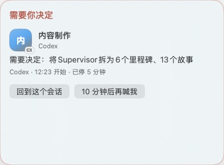
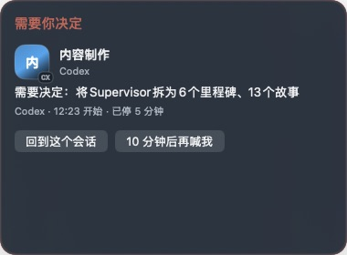

# Jingle live acceptance - 2026-07-30

This report records only evidence observed on the installed macOS runtime. It does not use fabricated hook JSON as provider evidence.

## Runtime

- The user LaunchAgent `io.github.zinan92.codex-jingle` was installed from main and `launchctl print` reported `state = running`, with the program set to `Codex 通知设置.app/Contents/MacOS/CodexNotificationSettings`.
- The first LaunchAgent implementation attempted to execute the `.app` bundle and returned `EX_CONFIG`. It was reverted in PR #60 and corrected in PR #61 before this evidence was collected.

## Real provider hooks

Two non-interactive, no-tool probes were run in separate unmapped temporary directories.

| Provider | Observed lifecycle | Final policy | Queue effect |
| --- | --- | --- | --- |
| Claude Code 2.1.220 | `running` then `done` | `blocked_only` | `needs_attention = false` |
| Codex CLI 0.146.0 | `running` then `done` | `blocked_only` | `needs_attention = false` |

Both probes wrote their lifecycle events through the installed hooks. Claude recorded normal end-only accounting; the ephemeral Codex transcript correctly recorded accounting as unavailable. Neither emitted a visible completion queue item.

The live ledger contained mapped main-task Work Units from both providers: Codex and
Claude each recorded `running → done` under `task_terminal`, with accounting
completed. A real mapped Codex blocked Work Unit displayed exactly one call card in
the running app, with the project persona, provider badge, summary, and the two
expected controls.

A separate real mapped Claude probe dispatched exactly one `jingle_probe` child
agent, which returned `JINGLE_CHILD_OK`; its parent then returned
`JINGLE_PARENT_OK`. Jingle's ledger contains only the parent Work Unit for that
session—no child Work Unit, queue row, or call was created. This is intentional:
the installed lifecycle hooks subscribe to the main-task start/stop events rather
than registering a queue-producing child hook, while the adapter retains explicit
child-event suppression tests.

## Safe return-to-session

- Clicking the real mapped Codex call card returned `未定位原 Codex 会话，未打开任何新项目或会话。`
- Running the installed return helper for the real Claude probe session returned `未定位原 Claude 会话，未打开任何新项目或会话。`

Both are explicit safe failures. No terminal, project, or new session was created.

## Visual evidence

The real running app was temporarily switched through the macOS Appearance UI to Light mode and captured here:

The Light-mode card shows the measured rounded panel, custom material/palette, project persona, outlined provider badge, and call-state controls. The machine was restored to Dark appearance immediately after capture.

The restored, real Dark-mode card was also captured:

## Terminal-process regression and resolution

The mapped child-agent command exposed a real Claude edge case: after the parent
completed, the CLI reported budget exhaustion and did not emit its normal
turn-level `Stop` or `StopFailure`. [PR #64](https://github.com/zinan92/codex-jingle/pull/64)
closed [#63](https://github.com/zinan92/codex-jingle/issues/63) by opting into
Claude's official `SessionEnd` event. A fresh, real 0.01 USD budget-exhaustion
probe then recorded `running → blocked (claude_session_end)`, one accounting pass,
and no stale running Work Unit. The two pre-fix test records were explicitly
acknowledged after recovery so they do not remain in the user's attention queue.

## Final gates

- `python3 -m unittest discover -s tests -p 'test_*.py'`: 86 passed
- `swiftc -parse -framework AppKit -framework SwiftUI src/JinglePanelLayout.swift src/CodexNotificationSettings.swift`: passed
- `gitleaks detect --source . --no-banner --redact`: no leaks
- The installed LaunchAgent remained `state = running` after the updated install.
